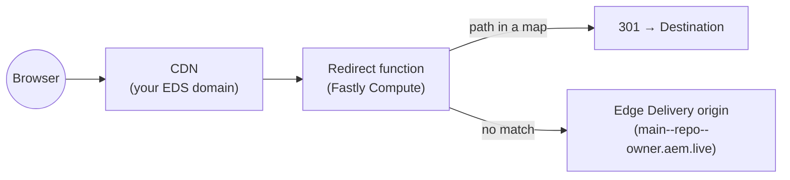

# Edge Delivery redirect maps



An Edge Function that applies **large, JSON-sourced redirect maps** at the edge for an **AEM Edge Delivery** site: it loads one or more published redirect sheets, redirects matching paths, and passes everything else straight through to the Edge Delivery origin.

This is the **Edge Delivery counterpart** to [`publish-delivery-redirect-maps`](../publish-delivery-redirect-maps) (the AEM as a Cloud Service publish-tier version). It is deliberately **much simpler**, because Edge Delivery lets us drop three pieces the AEMaaCS version needs:

- **No KV store and no maintenance endpoint** — maps are loaded directly from JSON on the origin and cached at the edge, rather than swept into sharded KV.
- **No loopback** — on a miss the function fetches the page directly from the Edge Delivery origin (a different host from your customer domain), so there is no risk of routing back into the function.

## Why redirects at the edge for Edge Delivery

Edge Delivery uses a constrained, canonical URL space, so redirecting legacy or alternate URLs to canonical ones is a common need — and redirect sets can get large (migrations, multiple brands/campaigns, per-team lists). Edge Delivery authors redirects in a **spreadsheet published as JSON**; this example consumes that same JSON directly at the edge, so you can:

- run **big** redirect maps, and
- compose **several independently-owned maps** with a clear precedence,

while keeping the redirect decision at the CDN edge (fast, cacheable) and leaving the origin to serve pages.

> **Disclaimer.** This is an **informative reference**, not a required architecture. Most Edge Delivery sites should use the platform's built-in redirect handling. Reach for an edge function like this only when you have a specific need (very large or multiple composed redirect sets handled at the edge).

## What it does

For each request routed to it (see [CDN routing](#cdn-routing)):

1. Loads each configured redirect map (`REDIRECT_MAPS` in `src/config.js`) — **cached**, see [Caching](#caching).
2. Checks the request path against each map **in order; the first match wins**.
3. **Match →** responds with a redirect (`REDIRECT_STATUS`, default **301**) to the `Destination`.
4. **No match →** transparently fetches the same path from the Edge Delivery origin (`AEM_ORIGIN`) and returns it.

## Redirect map format

Each source in `REDIRECT_MAPS` is an Edge Delivery / Helix **published sheet** — the same JSON your project already serves for a redirects spreadsheet:

```json
{
  "total": 3,
  "offset": 0,
  "limit": 3,
  "data": [
    { "Source": "/old-home",     "Destination": "/" },
    { "Source": "/legacy/about", "Destination": "/company/about" },
    { "Source": "/promo",        "Destination": "https://campaign.example.com/promo" }
  ]
}
```

- **`Source`** — the incoming path to match (exact match on `URL.pathname`).
- **`Destination`** — where to send it. A **relative** target (e.g. `/company/about`) is returned as a relative `Location`, which the browser resolves against the domain it requested — so **no customer domain is hardcoded**. An **absolute** URL (e.g. `https://…`) is used verbatim, so a single map can mix same-site and cross-host redirects.
- A bare JSON array of `{ Source, Destination }` rows is also accepted; field names are matched case-insensitively.
- Each map redirects with its own **`redirectCode`** (301/302), falling back to `REDIRECT_STATUS` (default 301) when omitted — see [Multiple maps](#multiple-maps). Per-*row* status codes are not modelled; see [`src/lib/parse.js`](src/lib/parse.js) to extend.

### Multiple maps

`REDIRECT_MAPS` is an ordered list of `{ sourcePath, redirectCode? }` entries, so different teams can each own a JSON file — with explicit precedence (first match wins) and, optionally, their own redirect status:

```js
export const REDIRECT_MAPS = [
  { sourcePath: "/bigredirects.json" },                           // migration — uses default (301)
  { sourcePath: "/marketing-redirects.json", redirectCode: 302 }, // campaigns — temporary
];
```

`redirectCode` is optional per map and defaults to `REDIRECT_STATUS`, so a permanent migration map (301) and a temporary campaign map (302) can coexist.

## Caching

Each map is cached at **two layers** so steady-state lookups avoid both the network fetch and the JSON parse (see [`src/lib/redirects.js`](src/lib/redirects.js)):

| Layer | What | Shared across | Saves |
|-------|------|---------------|-------|
| **A — edge cache** (readthrough `CacheOverride`) | the fetched JSON bytes, keyed by source URL | all requests & instances at a POP | the network fetch (origin round-trip) |
| **B — in-memory memo** (module-scope map) | the **parsed** lookup map | requests on the same warm instance | the JSON parse |

On a warm instance a lookup is just a map read (Layer B). When Layer B is cold (new/recycled instance or after the memo TTL) the refill fetch is normally served from Layer A — the POP cache, shared across instances — so it avoids the origin round-trip and only pays the parse. Only when both layers are cold (or after the Layer-A TTL) does a request reach the origin.

- **`MAP_TTL_SECONDS`** (`src/config.js`, default 300 s) applies to both layers. After you publish a new sheet, in-flight instances keep serving the previous map until the TTL expires — redirect maps change rarely, so this is a deliberate trade of freshness for cost. Lower it if you need changes to appear faster.
- Layer B is **best-effort** (instances are recycled and traffic spreads across many), so it is only an optimization, never relied on for correctness.
- Keep individual maps within the platform's **per-request CPU budget** for edge functions — parsing happens once per TTL per instance, and lookup cost is a single map read. Very large maps increase the parse cost paid on a cold instance; if you need to scale beyond what a single-file parse comfortably handles, the KV-sharded [`publish-delivery-redirect-maps`](../publish-delivery-redirect-maps) approach is the heavier-duty alternative.

## Sizing and limits

Because this example holds each map **in memory** and parses it **on the request path** (on a cold instance or after the TTL — see [Caching](#caching)), map size is bounded by the Edge Function sandbox's per-execution resource limits rather than by a KV store. The relevant documented limits:

| Limit | Where it bites here |
|---|---|
| **128 MB heap** per execution | Every configured map's parsed form is resident at once (the in-memory memo), and they **sum**. A refresh transiently also holds the raw JSON plus the newly-parsed map. Multiple large maps are the main heap risk. |
| **1 s computation** per execution | Parsing a map is CPU work done **on the request path** for cold/refresh requests. A parse that exceeds the budget terminates **that** request — degrading a real navigation, since a cold instance has no cached map to fall back to. This is the tightest bound for a single large map. |
| **Average execution < 100 ms** | Warm lookups are ~sub-millisecond map reads, so the average stays low **only if cold parses are rare** — favour stable traffic and a longer `MAP_TTL_SECONDS`. |
| **100 MB max cached object** | Upper bound on one map's JSON at the edge-cache layer; heap and computation bind well before this. |
| **32 backend requests** per execution | Worst case is one fetch per map (all cold) plus the pass-through, so keep the **number** of maps small. |

See the [AEM Edge Functions limitations](https://experienceleague.adobe.com/en/docs/experience-manager-cloud-service/content/implementing/developing/edge-functions#limitations) and [Fastly Compute resource limits](https://docs.fastly.com/products/compute-resource-limits) for the authoritative values.

**Practical guidance.** This example suits **moderate** redirect sets — which covers most Edge Delivery canonical-URL redirect needs. Keep each map (and the total resident across all maps) comfortably within the heap and per-request computation budgets, keep the map **count** small, and use a longer TTL so the parse is paid rarely. For **very large** redirect sets the parse-on-request / all-maps-resident model is the wrong fit — use the KV-sharded [`publish-delivery-redirect-maps`](../publish-delivery-redirect-maps) instead, which reads only a small shard per lookup and confines the heavy parse to an off-path maintenance sweep.

## Project layout

| Path | Role |
|------|------|
| `src/index.js` | Fastly `fetch` entry; calls the redirect handler and request logging |
| `src/redirect.js` | `redirectHandler` — map lookup, redirect response, pass-through on miss |
| `src/config.js` | `AEM_ORIGIN`, `REDIRECT_MAPS`, `REDIRECT_STATUS`, `MAP_TTL_SECONDS` |
| `src/lib/redirects.js` | Two-layer cache: edge-cached fetch + parsed-map memo |
| `src/lib/parse.js` | Parse a published sheet into a lookup map (pure, unit-tested) |
| `src/lib/location.js` | Resolve a `Destination` to a `Location` value (pure, unit-tested) |
| `src/lib/` | Shared helpers (logging, responses) |
| `config/edgeFunctions.yaml` | Declares the edge service name (`edge-delivery-redirect-maps`) |
| `config/cdn.yaml` | Example origin selector routing page traffic to this function |
| `test/` | Unit tests + a `sample-bigredirects.json` fixture |

## Before you run or deploy

1. Set **`AEM_ORIGIN`** in `src/config.js` to your Edge Delivery URL (`https://<branch>--<repo>--<owner>.aem.live`).
2. Set **`REDIRECT_MAPS`** to the path(s) of your published redirect sheet(s) on that origin.
3. Adjust **`REDIRECT_STATUS`** (301/302) and **`MAP_TTL_SECONDS`** if needed.
4. Wire **Cloud Manager** config: [configuration pipeline](https://experienceleague.adobe.com/en/docs/experience-manager-cloud-service/content/operations/config-pipeline) for `edgeFunctions.yaml` / `cdn.yaml` (or `aio aem:rde:install -t env-config ./config` on RDE).

## CDN routing

`config/cdn.yaml` routes **publish**-tier page traffic (GET/HEAD, page-like URLs) on your domain to the edge function origin `edgefunction-edge-delivery-redirect-maps`. Notes:

- **Route only page URLs.** The rule matches `.html`, extensionless, and trailing-slash paths and excludes static assets, so images/CSS/JS are served directly by the CDN/origin. Tighten it to your URL space if you only redirect a known set of prefixes.
- **No loopback rule needed** (unlike the AEMaaCS example): the miss path fetches the Edge Delivery origin host directly, which is not this customer domain, so it never re-enters the function.

See [Origin selectors](https://experienceleague.adobe.com/en/docs/experience-manager-cloud-service/content/implementing/content-delivery/cdn-configuring-traffic#origin-selectors).

## Tooling

Install [Adobe I/O CLI](https://github.com/adobe/aio-cli), the AEM Edge Functions plugin, then log in and complete setup:

```bash
npm install -g @adobe/aio-cli
aio plugins:install @adobe/aio-cli-plugin-aem-edge-functions
aio login
aio aem edge-functions setup
```

Deploying to Cloud Service requires the **AEM Administrator** product profile. Then install project dependencies:

```bash
npm install
```

## Commands

| Goal | Command |
|------|---------|
| Unit tests | `npm run test` |
| Package for AEM | `aio aem edge-functions build` |
| Deploy (service name from YAML) | `aio aem edge-functions deploy edge-delivery-redirect-maps` |
| Local dev server (`http://127.0.0.1:7676`) | `aio aem edge-functions serve` |
| Tail `console.log` from the deployed function | `aio aem edge-functions tail-logs edge-delivery-redirect-maps` |

## Further reading

- [Fastly Compute / JavaScript](https://www.fastly.com/documentation/guides/compute/)
- [`publish-delivery-redirect-maps`](../publish-delivery-redirect-maps) — the AEM as a Cloud Service publish-tier counterpart (KV-sharded, with a maintenance endpoint)
