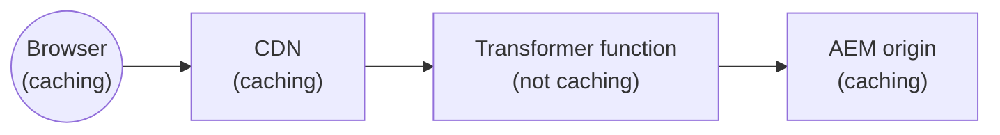

# Edge delivery transformer




```text
Browser - Caching according to Cache-Control header
  →  CDN (www.example.com) — Caching according to Surrogate-Control and Surrogate-Key headers
  →  Function transformer (edgefunction-<envid>-edge-delivery-transformer.adobeaemcloud.com) — Not caching
  →  AEM origin (https://main--repo--org.aem.live) — Caching
```

`<envid>` is the program/environment segment used in the edge function hostname (for example `pXXXX-dYYYYY` or `pXXXX-eYYYYY` ). `main--repo--org` matches your Edge Delivery URL pattern.

## Purpose

This example is a **reference for a cacheable transformer proxy**: it returns fully composed HTML while keeping **three caching layers** in the right roles.

**Disclaimer.** **Server-side rendering (or edge HTML assembly) is not a requirement for Adobe Edge Delivery.** Most sites should rely on Edge Delivery’s authoring and delivery model without an extra transformation hop. This example exists **only as an informative reference**—if you have a rare need to merge or rewrite HTML at the edge, the goal is to show **cache-safe behavior** and header handling, not to prescribe this architecture for typical projects.

The sample transforms HTML with **naive string replacement** (simple and easy to read, but brittle for real markup). For a **streaming, selector-based rewrite** at scale, use the Fastly Compute JavaScript toolkit described in [Rewriting HTML with the Fastly JavaScript SDK](https://www.fastly.com/blog/rewriting-html-with-the-fastly-javascript-sdk) (`HTMLRewritingStream` in `@fastly/js-compute` 3.35.0+).

---

| Layer | Caching |
|-------|---------|
| **Adobe CDN** (your publish domain, e.g. `www.example.com`) | **Should cache** the edge function response. Visitor traffic pays the transform cost on cache miss; CDN hits avoid another round-trip through the transformer for the same URL. |
| **Edge Function** (Fastly Compute) | **Should not cache** upstream fetches. The sample uses [`CacheOverride("pass")`](https://www.fastly.com/documentation/guides/concepts/edge-state/cache/) on outbound `fetch()` so the Compute path does not treat Edge Delivery URLs as independently cacheable blobs that are hard to purge in lockstep with this composition flow. |
| **AEM Edge Delivery** (origin) | **Caches** HTML and fragments. The transformer forwards cache-oriented response metadata (including merged **Surrogate-Key** values) so your CDN/origin invalidation stays coherent when content changes. |

In short: **origin and CDN hold cache; the function transforms on demand** (and still benefits from CDN caching of the assembled response).

## Verify caching

### How to read `x-cache`

`x-cache` lists one `HIT` or `MISS` per cache hop, **comma-separated**. **The last value is the hop closest to the client** (the outermost cache that answered for that request); earlier values reflect inner hops toward the origin.

Interpreting that **last** position for this example:

| Request path | Last `x-cache` token | Meaning |
|--------------|----------------------|---------|
| **Edge function hostname** (direct) | Always **`MISS`** | The transformer path under this sample does not cache the response at that outer hop; do not expect a trailing `HIT` here. |
| **Site domain** (via Adobe CDN) | **`MISS`** or **`HIT`** | **`MISS`** after a purge, cold edge, or first fill for that URL at that POP. **`HIT`** once the CDN has stored the response for that URL at that outer hop (see [invalidation check](#invalidate-and-recheck) below). |

Earlier tokens can still show `HIT`/`MISS` for inner hops (for example **AEM origin** cache). Exact counts vary with routing and warm state; focus on the **last** token for client-facing cache behavior.

### Baseline `curl`

After deploy, compare hop signatures on the **edge function hostname** versus your **site hostname** (`www.example.com` here as a stand-in for your publish domain).

**Edge function origin** — send BYO CDN headers so the stack matches a routed request:

```bash
curl -svo /dev/null "https://edgefunction-<envid>-edge-delivery-transformer.adobeaemcloud.com/" 
```

You should see a response header shaped like:

```http
x-cache: MISS, MISS, HIT, MISS
```

The **last** value should be **`MISS`**.

**Site (via CDN)** — same path through your configured domain:

```bash
curl -svo /dev/null "https://www.example.com/"
```

You should see something like:

```http
x-cache: MISS, MISS, MISS, MISS, HIT
```

When the outer CDN has the object, the **last** value is **`HIT`**. After you [invalidate](#invalidate-and-recheck) and request again, the **first** response at that edge should show **`MISS`** in the last position, then return to **`HIT`** on a subsequent request for the same URL.

### Invalidate and recheck

Confirm **site-domain** invalidation by purging upstream content that participates in the transformed page, then probing your **publish hostname** so the outer CDN reflects the purge.

**1.** Issue a purge for at least one of the dependencies the transformer merges (adjust `<org>`, `<repo>`, `<branch>` to match `https://<branch>--<repo>--<org>.aem.live`):

**Nav**

```bash
curl -siX POST "https://admin.hlx.page/cache/<org>/<repo>/<branch>/nav"
```

**Index**

```bash
curl -siX POST "https://admin.hlx.page/cache/<org>/<repo>/<branch>/index"
```

**2.** Immediately request the **composed page on the site domain** (not the raw edge function hostname), for example:

```bash
curl -svo /dev/null "https://www.example.com/"
```

**3.** Inspect `x-cache`. The **last** token should be **`MISS`** on the **first** request after invalidation succeeds, showing the CDN refetched through the transformer. Send the same request again; the **last** token should move to **`HIT`** once the CDN re-stores the response.

Repeat with the path you invalidated (for example homepage vs a deep link) when verifying index-specific behavior.

## What it does

The edge function proxies **AEM Edge Delivery** HTML and injects **nav** and **footer** fragments (from `/nav.plain.html` and `/footer.plain.html`) into the page’s `<header>` and `<footer>` tags—similar to composing header/footer on AEM Live.

- Fetches the requested path from a fixed Edge Delivery origin (see `AEM_ORIGIN` in `src/edge.js`).
- Forwards an allowlist of incoming headers on upstream fetches (`User-Agent`, `X-Forwarded-Host`).
- Lets **Edge Delivery cache** fragments and documents at the origin; uses **`CacheOverride("pass")`** on the function’s upstream fetches so the **Compute layer does not add its own cache** for those calls (see [Purpose](#purpose)).
- Merges **Surrogate-Key** values from the main document and fragment responses so the **CDN** can purge the assembled page alongside upstream resources—see **[Verify caching](#verify-caching)** for invalidation and `x-cache` checks.

## Project layout

| Path | Role |
|------|------|
| `src/index.js` | Fastly `fetch` entry; calls the transformer and request logging |
| `src/edge.js` | `edgeDeliveryHandler` — fetch, stitch, response headers |
| `src/lib/` | Shared helpers (logging, responses, config/secrets if you extend the sample) |
| `config/edgeFunctions.yaml` | Declares the edge service name (`edge-delivery-transformer`) |
| `config/cdn.yaml` | Example origin selector routing publish traffic to this function |

## Before you run or deploy

1. Set **`AEM_ORIGIN`** in `src/edge.js` to your Edge Delivery preview/live URL (HTTPS only).
2. Ensure your Edge Delivery project exposes **`/nav.plain.html`** and **`/footer.plain.html`** (or change those paths in `edge.js`).
3. Wire **Cloud Manager** config: [configuration pipeline](https://experienceleague.adobe.com/en/docs/experience-manager-cloud-service/content/operations/config-pipeline) for `edgeFunctions.yaml` / `cdn.yaml` (or `aio aem:rde:install -t env-config ./config` on RDE).

## Tooling

Install [Adobe I/O CLI](https://github.com/adobe/aio-cli), the AEM Edge Functions plugin, then log in and complete setup:

```bash
npm install -g @adobe/aio-cli
aio plugins:install @adobe/aio-cli-plugin-aem-edge-functions
aio login
aio aem edge-functions setup
```

Deploying to Cloud Service requires the **AEM Administrator** product profile.

Project dependencies:

```bash
npm install
```

## Commands

| Goal | Command |
|------|---------|
| Unit tests | `npm run test` |
| Package for AEM | `aio aem edge-functions build` |
| Deploy (service name from YAML) | `aio aem edge-functions deploy edge-delivery-transformer` |
| Local dev server (`http://127.0.0.1:7676`) | `aio aem edge-functions serve` |
| Tail `console.log` from the deployed function | `aio aem edge-functions tail-logs edge-delivery-transformer` |

## CDN routing

`config/cdn.yaml` routes **publish** tier traffic to the edge function origin `edgefunction-edge-delivery-transformer`. For this transformer pattern you typically want **normal CDN caching** for matching URLs—that is **not** opting out via `skipCache: true`, which would force every request through uncached traversal. Tune path/host rules and cache policies to your rollout; see [Origin selectors](https://experienceleague.adobe.com/en/docs/experience-manager-cloud-service/content/implementing/content-delivery/cdn-configuring-traffic#origin-selectors).

**Route only HTML pages for efficiency.** The transformer is meant for composed **documents** (pages), not static delivery. Sending **assets** (for example `.css`, `.js`, images, fonts, or other extensions) through the edge function wastes compute and adds latency where the CDN and origin can serve bytes directly. **Recommendation:** narrow origin-selector rules so only paths that represent HTML pages match—e.g. URLs that end with `.html`, end with `/` (directory or extensionless pages, depending on your site), or otherwise match your extensionless routing—**and exclude** typical static extensions. The sample adds an `originalPath` `matches` condition for that idea; tighten or replace the expression to match your URL patterns and asset layout.

## Further reading

- [Fastly Compute / JavaScript](https://www.fastly.com/documentation/guides/compute/)
- [Local `serve` behavior](https://www.fastly.com/documentation/reference/cli/compute/serve/) (Fastly CLI)
