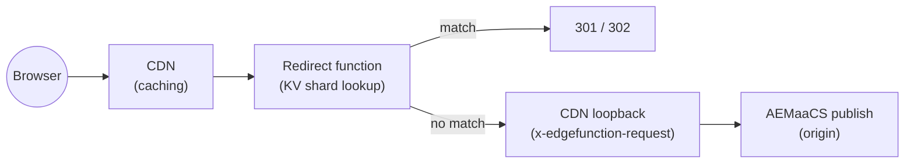

# Publish delivery redirect maps



```text
Browser
  →  CDN (www.example.com, no x-edgefunction-request)
  →  Redirect function (edgefunction-<envid>-publish-delivery-redirect-maps.adobeaemcloud.com)
       — FNV-1a shard of the path → KV shard lookup (cached per POP)
  →  301/302 if the path is in a map
     otherwise loopback: CDN (www.example.com, x-edgefunction-request present) → AEMaaCS publish
```

`<envid>` is the program/environment segment in the edge function hostname (e.g. `pXXXX-dYYYYY` or `pXXXX-eYYYYY`).

## Purpose

This example demonstrates **large-scale URL redirect maps at the CDN edge** using AEM Edge Functions — an edge-native alternative to Apache/Dispatcher-based redirect maps for AEMaaCS publish delivery. The redirect decision is made at the CDN POP: matched redirects never reach the Dispatcher or AEM Publish tier, and there is no 1024-byte line-length limit as with Apache `RewriteMap`.

It builds on the [publish-delivery-transformer](../publish-delivery-transformer) example: the same **loopback** pattern is reused so that a redirect *miss* falls through to AEMaaCS publish, while a *hit* returns a redirect directly from the edge.

**This is a focused reference example, not a turnkey production project.** It concentrates on the aspects that are specific to running redirect maps on Edge Functions — sharded KV storage and the CPU/wall-time cost of the maintenance calls that keep those shards fresh (see [Performance and platform limits](#performance-and-platform-limits)). To stay small and aligned with the other examples, it hardcodes the publish host and the map definitions, and it omits production concerns such as secret-based origin-host validation and access control on the maintenance endpoint. Adapt those for your deployment.

## How it works

The single Edge Function serves two request paths:

| Path | Purpose | Traffic |
|------|---------|---------|
| Any URL (default) | Redirect lookup | High — every routed publish request |
| `/__redirectmaps-maintenance` | Rebuild one shard | Low — driven by an external scheduler |

**Redirect lookup** (`src/redirect-lookup.js`) is optimized for speed: it hashes the request path with FNV-1a to pick one of 256 shards, reads that shard from the per-POP edge cache (falling back to KV), and returns a `301`/`302` if the path is present. On a miss it loops back through the CDN — with the `x-edgefunction-request` marker set — so the origin-selector routes the request to AEMaaCS publish instead of back into the function.

**Maintenance** (`src/redirect-maintenance.js`) is optimized for correctness: each call fetches the full TXT source, parses it, and rebuilds exactly **one** shard, writing to KV only when the shard content changed (SHA-256 comparison). A cursor in KV advances one step per call, cycling through every `(map, shard)` pair.

### Sharding

The redirect inventory is partitioned into **256 fixed shards** by FNV-1a hash of the source path. Each shard is one KV entry holding a JSON object of the redirects in that shard. This keeps each lookup to a single small KV read + `JSON.parse`, and keeps each maintenance write within the KV entry-size and write-rate limits, regardless of the total redirect count.

## Project layout

| Path | Role |
|------|------|
| `src/index.js` | Fastly `fetch` entry point; routes to lookup or maintenance and logs the request |
| `src/redirect-lookup.js` | Shard lookup → `301`/`302`, or loopback to publish on miss |
| `src/redirect-maintenance.js` | Rebuilds one shard per call; returns progress + per-phase timings |
| `src/config.js` | **Edit this** — the publish host and the redirect map definitions |
| `src/lib/shard.js` | FNV-1a hashing, 256-shard bucketing, KV key helpers |
| `src/lib/parse.js` | Allocation-light line parser for the TXT source |
| `src/lib/location.js` | Resolves a target to a `Location` value (`absolute` / `passthrough`) |
| `src/lib/` | Shared logging / response helpers |
| `config/edgeFunctions.yaml` | Declares the edge service and enables the KV store |
| `config/cdn.yaml` | Origin-selector rule routing publish page traffic to this function |
| `test/` | Unit tests, a sample TXT source, and the maintenance-cycle driver |

## Configuration

All configuration lives in **`src/config.js`** and is baked into the WASM artifact at build time:

```javascript
export const PUBLISH_HOST = "www.example.com"; // your AEMaaCS publish domain

export const MAPS = [
  { id: "legacy",    sourcePath: "/content/dam/redirects/sample-redirects.txt", redirectCode: 301, locationMode: "absolute" },
  { id: "migration", sourcePath: "/content/dam/redirects/large-redirects.txt",  redirectCode: 301, locationMode: "absolute" },
];
```

| Field | Meaning |
|-------|---------|
| `id` | KV key prefix / identifier for the map |
| `sourcePath` | Path to the TXT source on the publish origin (fetched from `https://<PUBLISH_HOST><sourcePath>`) |
| `redirectCode` | `301` (permanent) or `302` (temporary) |
| `locationMode` | `absolute` (prepend `https://<PUBLISH_HOST>`) or `passthrough` (use the target verbatim). Absolute-URL targets are always passed through. |

Lookups check each map in order; the first match wins.

> **Production note.** Hardcoding `PUBLISH_HOST` keeps this example simple. A production deployment typically passes the customer-facing domain from the CDN (`reqProperty: domain`) so one build serves multiple domains, and validates a shared secret header before performing the loopback to avoid an open loopback (SSRF) vector.

### Data source format

The source is the Apache RewriteMap TXT format — one `source target` pair per line, whitespace-separated, with `#` comments and blank lines ignored:

```text
/old-page            /new-page
/legacy/about        /about-us
/promo               https://campaign.example.com/promo
```

Any fetchable `text/plain` URL on the publish origin works: a DAM asset, an ACS Commons [Redirect Map Manager](https://adobe-consulting-services.github.io/acs-aem-commons/features/redirect-map-manager/index.html) or [Redirect Manager](https://adobe-consulting-services.github.io/acs-aem-commons/features/redirect-manager/index.html) servlet, or a custom servlet. See `test/sample-redirects.txt` for a small example.

If your source is a DAM asset, the default Dispatcher filters block `.txt` under `/content/dam`. Allow the maintenance fetch through:

```
# conf.dispatcher.d/filters/filters.any
/0200 { /type "allow" /method "GET" /path "/content/dam/redirects/*" /extension "txt" }
```

## Maintenance

Redirect data is **not** loaded at deploy time. An external scheduler must call the maintenance endpoint periodically to populate and refresh the KV shards.

```bash
curl "https://www.example.com/__redirectmaps-maintenance"
```

Each call processes one `(map, shard)` pair, so a full refresh of `N` maps takes `N × 256` calls. **Calls must be serialized** (one in flight at a time) — the cursor is a non-atomic read-modify-write, so overlapping calls can process a shard twice or skip one. Use a trigger interval longer than the worst-case call duration (see below).

A helper script drives full cycles and can print per-call timings:

```bash
# One map (256 steps, 1s apart)
./test/run-maintenance-cycle.sh https://www.example.com

# Two maps (512 steps), full JSON incl. timings for each step
./test/run-maintenance-cycle.sh --verbose https://www.example.com 512
```

Each response reports progress, whether the shard changed, and per-phase timings:

```json
{
  "success": true,
  "map": "migration",
  "shard": "62",
  "changed": false,
  "entries": 395,
  "durationMs": 4362,
  "timings": { "fetchMs": 420, "parseMs": 2925, "jsonStringifyMs": 0, "sha256Ms": 233, "totalLines": 100004 },
  "progress": { "step": 99, "totalSteps": 512, "completedCycles": 1, "firstCycleComplete": true }
}
```

`firstCycleComplete` turns `true` once every shard has been written at least once — i.e. once redirect coverage is complete. `changed` is `false` when the shard's content matched what was already in KV, so no write was needed (KV allows 1 write/sec/item).

## Performance and platform limits

Redirect maps on Edge Functions have two very different cost profiles, and the maintenance side is where the platform limits actually bite. These numbers come from profiling runs with a ~100,000-line source (~7 MB TXT) using the `--verbose` flag above.

**Redirect lookup** (every request): one edge-cache or KV read plus a `JSON.parse` of a single shard (~40 KB for 100K redirects). Typically **< 1 ms CPU**, single-digit-ms wall time — negligible even at high traffic, and unaffected by any reasonable CPU limit.

**Maintenance** (per call, 100K-line source):

| Phase | Cost | Notes |
|-------|------|-------|
| Source fetch (`fetchMs`) | ~130–770 ms | Bimodal: CDN cache hit vs origin revalidation; network-bound, not CPU |
| **Parse loop (`parseMs`)** | **~1,300–3,300 ms** | FNV-1a over every line — the dominant CPU cost |
| SHA-256 (`sha256Ms`) | ~90–330 ms | Change detection over the shard JSON — pure-JS `@noble/hashes`, faster here than `crypto.subtle` |
| KV I/O + overhead | ~700–1,200 ms | Hash compare, cursor advance |
| **Total wall time** | **~2.3–5.2 s** | |

Two independent things drive the spread:

- **Parsing is CPU-bound and O(lines).** Every line is hashed for shard assignment even though only ~1/256th land in the target shard. This is the cost that scales with source size.
- **Edge node hardware varies within a single POP.** Across profiling runs pinned to one POP, the CPU-bound phases (parse + SHA-256) varied by roughly **~2×** between faster and slower node classes serving the same datacenter, while fetch time varied independently (cache state) and infrastructure overhead stayed constant. Requests rotate across node classes, so the same source can take ~2.3 s on a fast node and ~5 s on a slow one.

### The 1-second CPU limit

Edge Functions have a documented **1-second CPU limit** per request — CPU work-time only; network and KV waits don't count. Size each source so its parse stays within that budget. Because parsing dominates the CPU cost and node hardware varies, size against the **slowest** node, which puts the practical ceiling around **~20,000 lines per individual TXT source file** (order-of-magnitude):

| Source size (lines) | Est. CPU (wall-time proxy) | Within 1s? |
|---|---|---|
| 1,000 | ~50 ms | Yes |
| 10,000 | ~325 ms | Yes |
| **~20,000** | **~0.9 s** | **Threshold** |
| 50,000 | ~1.9 s | No |
| 100,000 | ~3.4 s | No |

> **How these numbers relate to the limit.** The `*Ms` values above are wall-clock measurements taken inside the function (`Date.now()` around each phase), used here as a *proxy* for the platform's billed CPU. For the synchronous, CPU-bound phases (`parseMs`, `sha256Ms`) wall time closely tracks CPU work and, since it also captures scheduling overhead, tends to slightly over-estimate it — so the estimate errs on the safe side. The platform's own CPU accounting is reported in aggregate and can vary with processor and node, so treat the line ceiling as a **conservative planning estimate**, not an exact cutoff. Design large sources with the mitigations below rather than sitting right on the limit.

What matters is the **line count of each individual source file**, not the total across all maps or the number of maps — each maintenance call parses exactly one source. Twenty maps of 10,000 lines each are fine; one map of 25,000 lines is not.

The **redirect lookups are never affected** — only the maintenance rebuild of an oversized source is. If a maintenance call is terminated, the cursor does not advance and that shard is retried on the next call, so a call that fails on a slow node can still succeed when it lands on a faster one; a source above the threshold fails on every node class.

To stay within the limit with large inventories:

- **HTTP conditional requests** (`ETag` / `If-Modified-Since`) — skip the fetch and parse entirely when the source is unchanged, cutting steady-state CPU to near zero. Best lever for maps that change infrequently.
- **Split large sources** into multiple TXT files under the threshold, each configured as its own map.

### WAF

If Edge WAF is enabled on the CDN, it inspects the maintenance calls routed via the publish hostname and adds roughly **1.5–2 s of wall time** per call (network latency, not CPU). Size the maintenance trigger interval above the worst-case wall time including this overhead.

## CDN routing

`config/cdn.yaml` routes **GET/HEAD publish-tier page requests** to the edge function when `x-edgefunction-request` is absent. The loopback fetch (marker present) falls through to AEMaaCS publish.

- **GET/HEAD only** — redirects are a navigation concern; routing `POST`/`PUT`/etc. through the function would drop the request body on a loopback.
- **Page URLs only** — the `originalPath` matcher targets `.html`, extensionless, and trailing-slash paths, so static assets bypass the function. If you only migrate a known URL space (an old domain, or specific pre-migration prefixes), tighten the matcher further so unrelated traffic never enters the function.

## Before you run or deploy

1. Set **`PUBLISH_HOST`** and the **`MAPS`** definitions in `src/config.js`.
2. Publish each source as a reachable `text/plain` URL on your publish origin (add the Dispatcher filter above for DAM `.txt` sources).
3. Wire **Cloud Manager** config: run a [configuration pipeline](https://experienceleague.adobe.com/en/docs/experience-manager-cloud-service/content/operations/config-pipeline) for `edgeFunctions.yaml` / `cdn.yaml` (or `aio aem:rde:install -t env-config ./config` on RDE).
4. Start an external scheduler calling `/__redirectmaps-maintenance` to populate and refresh the shards.

## Commands

`npm run test` runs the unit tests. Build, deploy, local `serve`, and log tailing use the standard `aio aem edge-functions` commands (service name `publish-delivery-redirect-maps`).

The local dev server pre-populates a couple of sample shards (see `[local_server]` in `fastly.toml`), so `curl "http://127.0.0.1:7676/old-home"` returns a redirect without first running maintenance.

## Limitations

- **No cron/daemon** — Edge Functions are request-driven; an external scheduler must call the maintenance endpoint.
- **Eventual consistency** — KV is eventually consistent, and lookups cache shards per POP for 300 s, so a freshly rebuilt shard may take up to that long to be visible everywhere.
- **Full source fetch per shard** — each maintenance call re-fetches and re-parses the entire source to rebuild one shard; conditional requests (ETag) avoid this when the source is unchanged.
- **Single-file line count** governs the CPU limit, as described above.

## Further reading

- [AEM Edge Functions](https://experienceleague.adobe.com/en/docs/experience-manager-cloud-service/content/implementing/developing/edge-functions)
- [Fastly Compute / JavaScript](https://www.fastly.com/documentation/guides/compute/)
- [AEMaaCS CDN configuration](https://experienceleague.adobe.com/en/docs/experience-manager-cloud-service/content/implementing/content-delivery/cdn-configuring-traffic)
