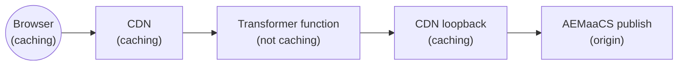

# Publish delivery transformer



```text
Browser — Caching according to Cache-Control header
  →  CDN (www.example.com, no x-edgefunction-request)
       — Caches transformed response per Surrogate-Control / Surrogate-Key
  →  Transformer function (edgefunction-<envid>-publish-delivery-transformer.adobeaemcloud.com)
       — Does NOT cache; fetches via loopback with x-edgefunction-request header
  →  CDN loopback (www.example.com, x-edgefunction-request present)
       — Origin-selector routes to AEMaaCS publish; CDN caches publish content
  →  AEMaaCS publish tier (origin)
```

`<envid>` is the program/environment segment in the edge function hostname (e.g. `pXXXX-dYYYYY` or `pXXXX-eYYYYY`).

## Purpose

This example demonstrates a **cacheable transformer proxy** for **AEMaaCS publish** that uses a **loopback** pattern to preserve CDN caching of origin content.

### Why loopback?

Without loopback, the edge function would fetch directly from the AEMaaCS publish origin, bypassing the CDN cache for origin content. With loopback the function fetches back through the CDN (`www.example.com`) with the `x-edgefunction-request` header set. The CDN sees that header in the origin-selector rule and routes to AEMaaCS publish instead of back into the function, avoiding infinite recursion.

This gives you **two independent cache layers**:

| Layer | Caches |
|-------|--------|
| **Outer CDN** (`www.example.com`, no `x-edgefunction-request`) | Transformed response |
| **Inner CDN** (`www.example.com`, `x-edgefunction-request` present) | Raw AEMaaCS publish response |

> **Cache-key note.** Whenever an origin-selector rule matches, the CDN treats the selected origin as part of the cache key. Because `www.example.com/path` is routed to different origins depending on whether `x-edgefunction-request` is present or absent, the CDN maintains **two separate cache entries** for the same URL path — one for the transformed response (no header) and one for the raw AEMaaCS publish response (header present). They are stored and invalidated independently.

Content invalidation flows via `Surrogate-Key` headers: the function forwards them from the AEMaaCS publish response to its own response, so a purge of an AEMaaCS page also purges the transformed version at the outer CDN.

### Loop prevention

The `x-edgefunction-request` header is the anti-loop sentinel:

```
www.example.com → edge function          (no x-edgefunction-request → routed to function)
                → www.example.com        (x-edgefunction-request: true → routed to AEMaaCS publish)
                → AEMaaCS publish tier
```

The CDN origin-selector rule matches only when the header is **absent**:

```yaml
- { reqHeader: x-edgefunction-request, exists: false }
```

When the loopback request arrives with the header present, no rule matches and the CDN falls through to its default AEMaaCS publish routing.

---

## Project layout

| Path | Role |
|------|------|
| `src/index.js` | Fastly `fetch` entry point; calls the transformer and logs the request |
| `src/edge.js` | `publishDeliveryHandler` — loopback fetch, transformation, response headers |
| `src/lib/` | Shared helpers (logging, responses) |
| `config/edgeFunctions.yaml` | Declares the edge service name (`publish-delivery-transformer`) |
| `config/cdn.yaml` | Origin-selector rule routing publish HTML traffic to this function |

## What the sample transformation does

`src/edge.js` injects a custom `<script>` tag before `</head>` as a stand-in for any server-side enrichment (personalization, analytics, A/B test scripts, etc.):

```javascript
function transformHtml(html) {
  const customScript = `<script src="/custom-experience.js" defer></script>`;
  return html.replace(/<\/head>/i, `${customScript}\n</head>`);
}
```

Replace or extend `transformHtml` with your actual business logic.

For **streaming, selector-based rewrites** at scale, use `HTMLRewritingStream` from the Fastly Compute JavaScript toolkit described in [Rewriting HTML with the Fastly JavaScript SDK](https://www.fastly.com/blog/rewriting-html-with-the-fastly-javascript-sdk) (`@fastly/js-compute` 3.35.0+).

## Before you run or deploy

1. Set **`PUBLISH_HOST`** in `src/edge.js` to your AEMaaCS publish domain (e.g. `"www.mysite.com"`).
2. Wire **Cloud Manager** config: [configuration pipeline](https://experienceleague.adobe.com/en/docs/experience-manager-cloud-service/content/operations/config-pipeline) for `edgeFunctions.yaml` / `cdn.yaml` (or `aio aem:rde:install -t env-config ./config` on RDE).
3. Ensure the loopback backend (`www.example.com` / your publish domain) is reachable from the Fastly Compute service. AEM Edge Functions infrastructure configures this automatically for your environment's publish domain.

## Tooling

Install [Adobe I/O CLI](https://github.com/adobe/aio-cli), the AEM Edge Functions plugin, then log in and complete setup:

```bash
npm install -g @adobe/aio-cli
aio plugins:install @adobe/aio-cli-plugin-aem-edge-functions
aio login
aio aem edge-functions setup
```

Deploying to Cloud Service requires the **AEM Administrator** product profile.

Project dependencies:

```bash
npm install
```

## Commands

| Goal | Command |
|------|---------|
| Unit tests | `npm run test` |
| Package for AEM | `aio aem edge-functions build` |
| Deploy (service name from YAML) | `aio aem edge-functions deploy publish-delivery-transformer` |
| Local dev server (`http://127.0.0.1:7676`) | `aio aem edge-functions serve` |
| Tail `console.log` from the deployed function | `aio aem edge-functions tail-logs publish-delivery-transformer` |

## CDN routing

`config/cdn.yaml` routes **publish** tier HTML traffic to the edge function when `x-edgefunction-request` is absent. The loopback fetch (with the header set) falls through to AEMaaCS publish via the default origin routing.

**Route only HTML pages.** The transformer is designed for composed HTML documents. Static assets (`.css`, `.js`, images, fonts) should be served directly by the CDN without passing through the function. The sample `originalPath` regex already restricts matching to extensionless paths and `.html` URLs; tighten it further to match your URL layout.

## Verify caching

### `x-cache` interpretation

`x-cache` lists one `HIT`/`MISS` per cache hop, **comma-separated**. The **last** value is the hop closest to the client (outermost CDN).

| Request path | Expected last `x-cache` token |
|---|---|
| **Function hostname** (direct) | `MISS` — function response is not cached at that hop |
| **Site domain** (via Adobe CDN, cold) | `MISS` — first fill after deploy or purge |
| **Site domain** (via Adobe CDN, warm) | `HIT` — CDN served the cached transformed response |

### Baseline curl

**Via the edge function hostname** (bypasses outer CDN):

```bash
curl -svo /dev/null "https://edgefunction-<envid>-publish-delivery-transformer.adobeaemcloud.com/"
```

**Via the site domain** (full stack including outer CDN):

```bash
curl -svo /dev/null "https://www.example.com/"
```

### Invalidation

Purge via the AEMaaCS replication or cache-purge API. Because the transformer forwards `Surrogate-Key` headers, a purge of an AEMaaCS page also invalidates the transformed response at the outer CDN. After purging, the first request to `www.example.com` should show `MISS` in the last `x-cache` token, and subsequent requests should show `HIT`.

## Further reading

- [AEM Edge Functions](https://experienceleague.adobe.com/en/docs/experience-manager-cloud-service/content/implementing/developing/edge-functions)
- [Fastly Compute / JavaScript](https://www.fastly.com/documentation/guides/compute/)
- [Rewriting HTML with the Fastly JavaScript SDK](https://www.fastly.com/blog/rewriting-html-with-the-fastly-javascript-sdk)
- [AEMaaCS CDN configuration](https://experienceleague.adobe.com/en/docs/experience-manager-cloud-service/content/implementing/content-delivery/cdn-configuring-traffic)
